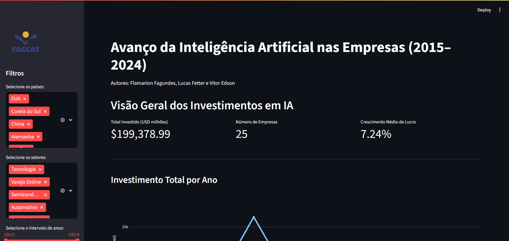

# 📊 Dashboard Avanço da IA nas Empresas"

Autores: `Flamarion Fagundes`, `Lucas Fetter` e `Vitor Edson`

https://avanco-ia-empresas.streamlit.app/

Este projeto é um dashboard interativo desenvolvido com Streamlit, que apresenta o avanço da Inteligência Artificial em empresas brasileiras de 2015 a 2024.

Projeto para a disciplina de Ciência de Dados, Faccat, Taquara, RS.

## Instruções para execução:

### Pré requisitos:

- Possuir o `python3` instalado
- Possuir o `pip` instalado

### Instalar as dependências necessárias:

- Streamlit: `pip install streamlit`

- Pandas: `pip install pandas`

- Plotly: `pip install plotly`

ou então execute o seguinte comando para instalar todas as dependências de uma só vez:

```bash
pip install -r requirements.txt
```

OBS: Para quem usa WSL2, ao tentar instalar as dependências, irá dar um erro de permissão. Para contornar esse problema, pode ser adicionada a seguinte flag após o comando:

`--break-system-packages`

### Executar o projeto localmente

- Primeiro é importante verificar se na pasta `data` da raiz contém o nosso arquivo CSV, com o nome `avanco_ia_empresas.csv`.

Após isso, basta rodar `streamlit run app.py` e abrir a URL http://localhost:8501/ no navegador para visualizar o Dashboard.

Exemplo da tela inicial que deverá aparecer:


